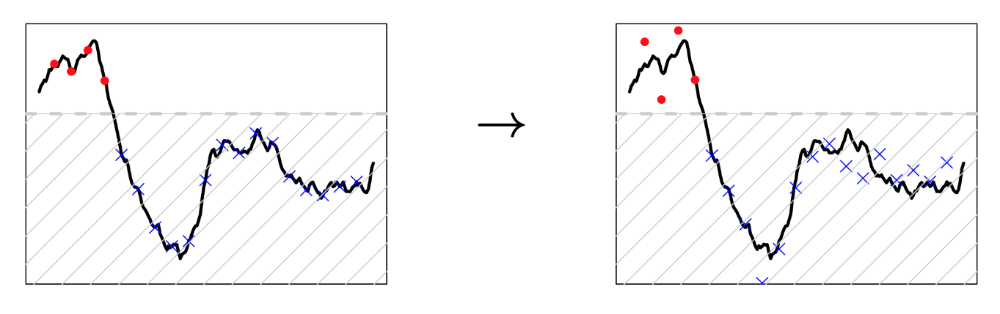

# SCALE MIXTURE for Flexible Extremal Dependence Model

## Research ongoing with Dr. Ben Shaby

[slides from JSM] (https://drive.google.com/file/d/1xUYZZ9jN4xxxkg57UQWvTDuV3Jp6d4p2/view?usp=sharing) .

We try to model dependence in extremes of spatial processes: 

### 1.  Flexible Spatial Modeling
We wish to fit spatial models encompassing both AD and AI, and let the data choose in between.

where

and 

,
.

### 2. Inference for Scale Mixtures

We are restricting focus to the tail by censoring, so that the low values won't affect the inference of the extremal dependence structure:

We sample the latent process as follows:

- Draw the smooth process _X*(s)_ given the noisy process _X(s)_.

(No truncation!)

- Draw the noise given the smooth process _X*(s)_.

(Truncated, but univariate!)

